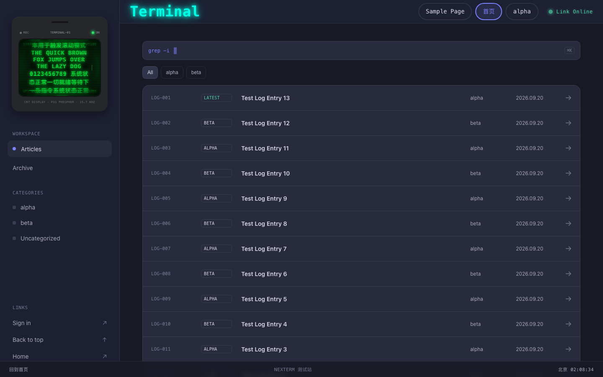
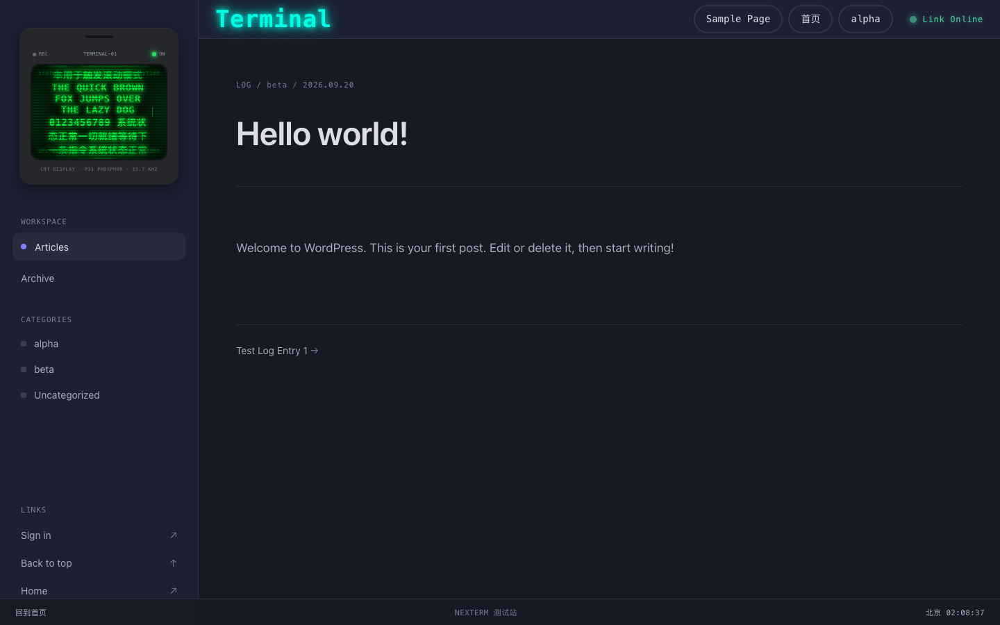

<div align="center">

# NEXTERM

**A minimal terminal-style WordPress theme — dark, monospaced, no images, with a live CRT companion.**

极简终端风格 WordPress 主题 —— 暗色、等宽、无图设计，内置 CRT 陪伴屏。

[](https://wordpress.org)
[](https://www.php.net)
[](http://www.gnu.org/licenses/gpl-2.0.html)
[](https://github.com/tanyuan-ai/nexterm/releases)



</div>

---

## English

### What is NEXTERM?

NEXTERM is a **terminal-style minimal WordPress theme**. It turns your blog into a dark command-line workspace: posts are rendered as log entries (`LOG-001`, `LOG-002` …), the search box greps, the sidebar carries a live CRT phosphor monitor companion, and the footer shows a real Beijing-time clock. No hero images, no decorative photos — pure typography, monospace accents and CRT glow.

### Highlights

- **Terminal aesthetic everywhere** — log-style post lists, `grep -i` search shell with ⌘K hint, LED status indicators, CRT scanline companion in the sidebar
- **Live CRT companion** — a phosphor monitor with eye-tracking animation, blink/idle "zZz" states, boot flicker and random glitch bars; click it for playful reactions
- **Fully customizable** — Appearance → Customize:
  - CRT Companion: phosphor color, scanline density, glow intensity, border thickness
  - Topbar LED / footer status bar: color, brightness, speed
  - Menu active style: **underline or pill outline**, thickness 1–8px, theme color or custom color
  - CRT text mode: size range 20%–300%
- **Terminal-style login** (`/wp-login.php`) and custom 404 page
- **Post thumbnails** — set a featured image and it renders as a framed terminal figure on the article page
- **Zero images by design** — the theme ships with no image assets; everything is CSS/JS
- **Accessibility & i18n ready** — screen-reader text, skip links, `prefers-reduced-motion` respected, one text domain (`nexterm`)

### Requirements

| | |
|---|---|
| WordPress | 6.0+ |
| PHP | 7.4+ |
| License | GPL v2 or later |

### Installation

**From a zip:**

1. Download the latest release from [Releases](https://github.com/tanyuan-ai/nexterm/releases)
2. In WordPress admin go to **Appearance → Themes → Add New → Upload Theme**
3. Upload the zip and click **Activate**

**Via git:**

```bash
cd wp-content/themes
git clone https://github.com/tanyuan-ai/nexterm.git
```

Then activate it in **Appearance → Themes**.

### Getting started

1. **Write posts** — they appear on the front page as log rows automatically
2. **Set a featured image** (optional) — shown on the single post page
3. **Customize** — Appearance → Customize → Nexterm panel:
   - *Menu active style* — underline (default) / outline, thickness, color
   - *CRT Companion* — phosphor color, scanlines, glow
   - *Topbar LED / Footer status* — color, brightness, animation speed
4. **Menus** — Appearance → Menus → assign to *Primary top navigation*

### Preview

| Front page | Single post |
|---|---|
|  |  |

---

## 中文说明

### NEXTERM 是什么？

NEXTERM 是一款**终端风格的极简 WordPress 主题**。它把博客变成一个暗色命令行工作台：文章以日志条目（`LOG-001`、`LOG-002`……）的形式呈现，搜索框是 `grep -i` 命令行，侧边栏内置一块实时 CRT 磷光屏陪伴组件，页脚显示真实的北京时间。没有大图、没有装饰照片 —— 纯排版、等宽字体和 CRT 辉光。

### 主要特性

- **全方位终端美学** —— 日志式文章列表、`grep -i` 搜索框（带 ⌘K 提示）、LED 状态指示灯、侧边栏 CRT 扫描线陪伴屏
- **实时 CRT 陪伴屏** —— 磷光显示器，眼球跟随动画、眨眼与闲置 "zZz" 状态、开机闪烁与随机故障条纹；点击它会有俏皮反应
- **深度可定制** —— 外观 → 自定义：
  - CRT 陪伴屏：磷光颜色、扫描线密度、辉光强度、边框粗细
  - 顶栏 LED / 页脚状态栏：颜色、亮度、动画速度
  - 菜单选中样式：**下划线或圆角描边**，粗细 1–8px，主题色或自定义颜色
  - CRT 文字模式：大小范围 20%–300%
- **终端风格登录页**（`/wp-login.php`）和自定义 404 页面
- **文章缩略图** —— 设置特色图像后会在文章页以终端边框样式展示
- **零图片设计** —— 主题本身不携带任何图片资源，全部由 CSS/JS 实现
- **无障碍与国际化就绪** —— 屏幕阅读器文本、跳转链接、遵循 `prefers-reduced-motion`、单一文本域（`nexterm`）

### 环境要求

| | |
|---|---|
| WordPress | 6.0+ |
| PHP | 7.4+ |
| 许可证 | GPL v2 或更高 |

### 安装方法

**zip 包安装：**

1. 从 [Releases](https://github.com/tanyuan-ai/nexterm/releases) 下载最新版本
2. 进入 WordPress 后台 **外观 → 主题 → 添加新主题 → 上传主题**
3. 上传 zip 并点击 **启用**

**git 安装：**

```bash
cd wp-content/themes
git clone https://github.com/tanyuan-ai/nexterm.git
```

然后在 **外观 → 主题** 中启用即可。

### 快速上手

1. **写文章** —— 发布后自动出现在首页日志列表
2. **设置特色图像**（可选）—— 会显示在文章页顶部
3. **自定义** —— 外观 → 自定义 → Nexterm 面板：
   - *菜单选中样式* —— 下划线（默认）/ 圆角描边，粗细与颜色可调
   - *CRT 陪伴屏* —— 磷光颜色、扫描线、辉光
   - *顶栏 LED / 页脚状态栏* —— 颜色、亮度、动画速度
4. **菜单** —— 外观 → 菜单 → 分配到 *Primary top navigation*

### 预览

| 首页 | 文章页 |
|---|---|
|  |  |

---

<div align="center">

**GPL v2+** · Built with pure CSS/JS, no build step required

</div>
